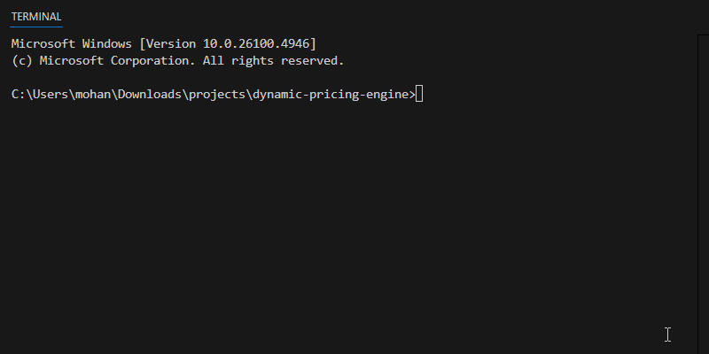

# Intelligent Dynamic Pricing Engine

[](https://www.python.org/downloads/release/python-390/)
[](https://opensource.org/licenses/MIT)

---

### **Live Demo URL:** [https://dynamic-pricing-service-532497372399.us-central1.run.app](https://dynamic-pricing-service-532497372399.us-central1.run.app)

_(Note: Link points to the deployed API endpoint. Use a tool like Postman or `curl` to test.)_

---

## Project Overview

## Project Overview

This project is an end-to-end data science application that predicts taxi demand in NYC and suggests dynamic pricing to maximize revenue. The core of the project is a machine learning model served via a REST API, containerized with Docker, and deployed on Google Cloud Run. This project demonstrates a complete MLOps workflow, from raw data processing to a live, scalable cloud deployment. While this implementation focuses on the NYC taxi domain, the end-to-end architecture is designed as a reusable blueprint for any dynamic pricing problem, such as for e-commerce, hotel bookings, or airline tickets.



## Key Features

- **Demand Prediction:** An XGBoost regression model trained on millions of taxi trips to forecast demand for any given hour and location.
- **Dynamic Pricing Logic:** A rule-based system that adjusts a base price using a multiplier derived from the predicted demand.
- **RESTful API:** A Flask application that exposes a `/predict` endpoint to serve real-time predictions.
- **Containerization:** The entire application is containerized with Docker for reproducibility and easy deployment.
- **Cloud Deployment:** Deployed as a serverless microservice on Google Cloud Run, ensuring scalability and availability.

## Tech Stack

- **Language:** Python 3.9
- **Machine Learning:** Scikit-learn, XGBoost, Pandas, NumPy
- **API & Web Server:** Flask, Gunicorn
- **Containerization:** Docker
- **Cloud Platform:** Google Cloud Run, Google Artifact Registry

## Local Setup and Installation

To run this project on your local machine, follow these steps:

1.  **Clone the repository:**
    ```bash
    git clone https://github.com/Kambammohankalyan/dynamic-pricing-engine.git
    cd dynamic-pricing-engine
    ```
2.  **Create and activate a virtual environment:**
    ```bash
    python -m venv venv
    source venv/bin/activate  # For Mac/Linux
    .\venv\Scripts\activate    # For Windows
    ```
3.  **Install dependencies:**
    ```bash
    pip install -r requirements.txt
    ```
4.  **Build the Docker image:**
    _(Ensure Docker Desktop is running)_
    ```bash
    docker build -t dynamic-pricing-api .
    ```
5.  **Run the Docker container:**
    ```bash
    docker run -p 8080:8080 dynamic-pricing-api
    ```

## API Usage

The API has one endpoint: `/predict`. Send a `POST` request with a JSON body to get a prediction.

**Example using `curl`:**

```bash
curl -X POST https://dynamic-pricing-service-532497372399.us-central1.run.app/predict -H "Content-Type: application/json" -d "{\"location_id\": 132}"
```

## Expected Response:

```json
{
  "location_id": 132,
  "predicted_demand": 89.94,
  "price_multiplier": 1.0,
  "recommended_price_usd": 10.0,
  "timestamp": "2025-08-27T07:12:04.955021"
}
```

## Challenges and Learnings:

This project involved several real-world challenges that provided significant learning opportunities:

- **Dependency Management:** Encountered and resolved a numpy binary incompatibility error inside the Docker container. This was fixed by pinning stable, compatible versions for all libraries in requirements.txt, a crucial practice for creating reproducible builds.

- **Model Versioning:** Discovered that a model saved with a bleeding-edge XGBoost version (3.0.4) was incompatible with the stable version (1.7.6) in production. The solution was to align the development and production environments by downgrading the local library and retraining the model, which is a key MLOps principle.

- **Environment-Specific Tooling:** Navigated differences between shell commands, specifically curl on the Windows Command Prompt vs. its Invoke-WebRequest alias on PowerShell, a common issue in cross-platform development.
